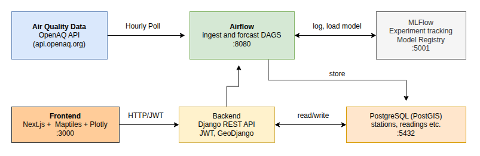

# IrelandAQ


Air quality monitoring and forecasting platform for Ireland, built with Django, Apache Airflow, and MLflow.



## Stack

- **Django + PostGIS** — REST API and station data
- **Airflow** — hourly ingestion from [OpenAQ v3](https://api.openaq.org)
- **MLflow** — model tracking and registry
- **Docker Compose** — local development
-  **Next.js** — frontend

## Quick start

```bash
cp .env.example .env   # fill in OPENAQ_API_KEY and secrets
docker compose up -d
```

Django runs at `http://localhost:8000`, Airflow at `http://localhost:8080`.
